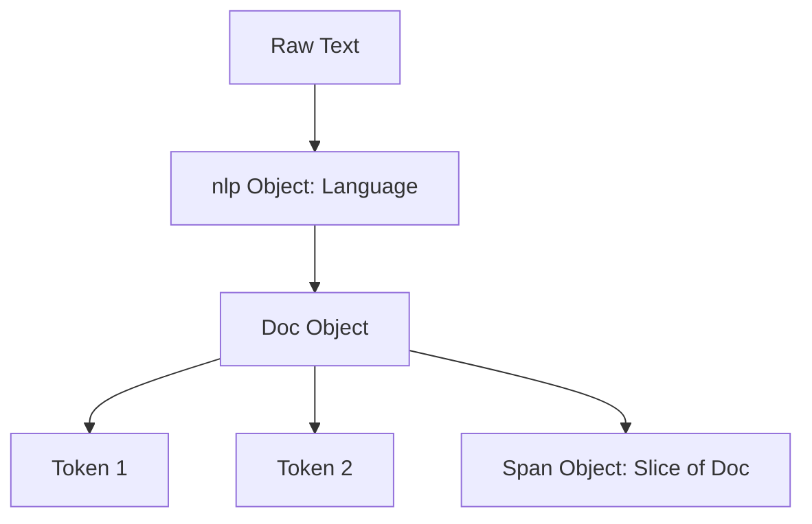

# spaCy: Industrial-Strength NLP in Python

Welcome to your spaCy learning sandbox! This document provides a high-level overview of spaCy, its architecture, and key features to help you grasp the "big picture" of the library.

---

## 1. What is spaCy?

spaCy is a free, open-source library for advanced Natural Language Processing (NLP) in Python. Unlike academic libraries like NLTK (which is great for learning and experimentation), spaCy is designed specifically for **production use**.

### Key Characteristics:

- **Fast:** Written in Cython for optimized performance.
- **Opinionated:** Instead of providing dozens of algorithms for a single task, spaCy selects and optimizes the single best-performing algorithm.
- **Deep Learning Integration:** Seamlessly supports pre-trained transformers (like BERT) and deep learning models.
- **Extensible:** Easily allows adding custom processing components and pipelines.

---

## 2. Core Concepts & Data Structures

Understanding spaCy's data structures is essential for working efficiently with the library.



### The Big Three Objects:

1. **`nlp` (Language class):** The pipeline manager. You load a model into `nlp`, and calling it on text (e.g., `doc = nlp(text)`) runs the text through the pipeline.
2. **`Doc`:** A container for accessing linguistic annotations. It is a sequence of `Token` objects.
3. **`Token` and `Span`:**
   - A `Token` represents a single word, punctuation mark, or whitespace.
   - A `Span` is a slice of a `Doc` (e.g., `doc[2:5]`), representing a phrase or sentence.

### Memory Optimization (`Vocab` and `StringStore`):

To save memory and increase speed, spaCy stores all strings (words, tags) as **64-bit hash values** in a central vocabulary (`Vocab`).

- When you look up a word, spaCy references the hash.
- This ensures that duplicate strings across multiple documents are stored only once.

---

## 3. The Processing Pipeline

When you call `nlp(text)`, the text is first tokenized to create a `Doc` object. Then, a series of pipeline components process the `Doc` sequentially.

```
       +----------+      +---------+      +--------+      +-----+
Text ->|Tokenizer | ---> | Tagger  | ---> | Parser | ---> | NER | ---> Doc
       +----------+      +---------+      +--------+      +-----+
```

### Key Built-in Components:

- **Tokenizer:** Splits text into words/punctuation. (This is _not_ a pipeline component but runs first, and it cannot be disabled).
- **Tagger (Part-of-Speech):** Assigns grammatical tags (noun, verb, adjective).
- **Morphologizer:** Assigns morphological features (e.g., plural, past tense).
- **Parser (Dependency Parser):** Defines grammatical relations between words (e.g., subject, object) and detects sentence boundaries.
- **NER (Named Entity Recognition):** Identifies named entities (e.g., people, organizations, locations).
- **Attribute Ruler:** Maps token attributes and patterns to tags (useful for custom adjustments).

---

## 4. Key Features to Explore

### 1. Tokenization, POS Tagging & Lemmatization

spaCy breaks down sentences and identifies lemmas (the base dictionary form of a word) along with their part-of-speech tags.

### 2. Dependency Parsing

Allows you to understand the grammatical structure of a sentence. You can find out which verb a noun belongs to, or extract subject-verb-object triples.

### 3. Named Entity Recognition (NER)

Locates and classifies named entities in text. Examples:

- "Apple" -> `ORG` (Organization)
- "Steve Jobs" -> `PERSON`
- "$100" -> `MONEY`

### 4. Rule-Based Matching

spaCy's `Matcher` and `PhraseMatcher` let you find words and phrases using rules based on token attributes (e.g., "find a token with lowercase 'apple' followed by a noun").

### 5. Word Vectors and Similarity

Using medium (`_md`) or large (`_lg`) models, spaCy can calculate the semantic similarity between two documents, spans, or tokens using pre-trained word vectors (Word2Vec).

---

## 5. Quick Code Reference

Here is how you can use the model we just installed (`en_core_web_sm`):

```python
import spacy

# 1. Load the pipeline
nlp = spacy.load("en_core_web_sm")

# 2. Process text
doc = nlp("Apple is looking at buying U.K. startup for $1 billion")

# 3. Part-of-Speech tagging & Lemmatization
for token in doc:
    print(f"{token.text:<10} | POS: {token.pos_:<6} | Lemma: {token.lemma_}")

# 4. Named Entity Recognition
print("\nEntities:")
for ent in doc.ents:
    print(f"{ent.text:<12} | Label: {ent.label_}")
```

---

## 6. How to Choose spaCy Models

spaCy provides different model sizes for various languages. For English:

| Model Name            | Size           | Speed  | Description                                                                                                                |
| --------------------- | -------------- | ------ | -------------------------------------------------------------------------------------------------------------------------- |
| **`en_core_web_sm`**  | Small (12 MB)  | Fast   | Good for basic tasks, POS tagging, parsing, NER. No static word vectors (uses context-sensitive vectors).                  |
| **`en_core_web_md`**  | Medium (40 MB) | Medium | Includes real word vectors (useful for similarity).                                                                        |
| **`en_core_web_lg`**  | Large (560 MB) | Slower | Large vocabulary, accurate word vectors.                                                                                   |
| **`en_core_web_trf`** | Transformer    | Slower | Uses transformer models (RoBERTa). Highest accuracy for NER, POS, and parsing (requires PyTorch/GPU for best performance). |

---

## 7. Next Steps for Learning

1. **Try simple tokenization and POS tagging** on different texts.
2. **Visualize parsing and entities** using `displacy` (spaCy's built-in visualizer).
3. **Build a custom pipeline component** to add metadata to tokens.
4. **Use `nlp.pipe()`** to process large volumes of text efficiently (essential for real projects).
